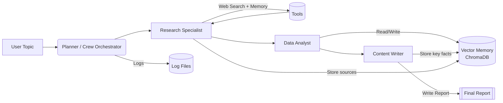

# Autonomous Research Agent — Architecture

## Overview
An agentic system that **plans**, **uses tools** (web search + memory), **analyzes**, and **writes** a final report.

- **Planner / Crew Orchestrator (`crew.py`)**: sets agent order and passes the shared `topic`.
- **Research Specialist**: searches the web, gathers sources, stores relevant URLs/snippets to memory.
- **Data Analyst**: extracts statistics, trends, and contradictions; reads memory for cross-checks.
- **Content Writer**: drafts a structured report; writes final output and important insights back to memory.
- **Vector Memory (`memory/`)**: ChromaDB + sentence-transformers for persistent semantic recall.
- **Tools (`tools/`)**: Serper web search with a DuckDuckGo fallback; Read/Write memory tools.
- **Observability**: `loguru` to capture runs in `logs/`.

## Decision-Making
- Each agent receives the **goal** and **context** from prior tasks and **Memory**.
- Agents decide to **ReadMemory** before writing and **WriteMemory** after discovering valuable facts.
- Web tool is used when the agent detects **knowledge gaps** or requires **source verification**.

## Autonomy & Safety
- Deterministic temperatures for reliability.
- Structured tasks define **acceptance criteria** (quality gates).
- Memory is scoped by `topic` metadata and can be cleared by deleting `./.memory`.
